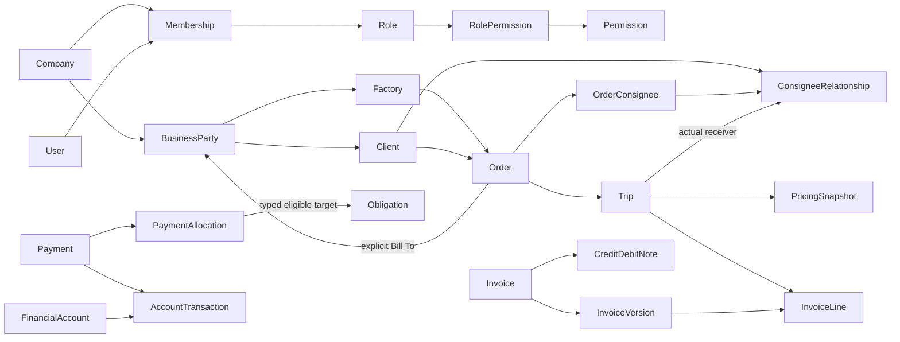

# Conceptual Data Model

Reviewed: 10 October 2026, branch `feat/project-setup`.
Status: **Conceptual Data Model: FINALIZED**. Business Requirements and Business Policies remain Finalized. Database/backend/providers and physical schema remain open. Development Ready v1.0 is not declared.

## 1. Authority, scope and review outcome

This is the authoritative provider-independent V1 domain model. [PRD.md](PRD.md) owns business requirements, [DECISIONS.md](DECISIONS.md) records policy/model decisions, [PERMISSIONS.md](PERMISSIONS.md) owns permission semantics and [AUDIT.md](AUDIT.md) owns event/redaction rules. [ARCHITECTURE.md](ARCHITECTURE.md) owns application boundaries. If a later requirement changes a model invariant, review this document explicitly rather than silently changing historical data.

Reviewed README, PRD, architecture, decisions, permissions, audit, security, test plan, design, components, tasks, memory and documentation review. Inspected the shared placeholder schema, web placeholder/navigation routes, quantity/money form controls and SearchableSelect option/loader contracts. They contain UI-only types, not an existing business domain or persistence model to preserve. Contextual searches also cover the client overview and the remaining repository Markdown.

The previous architecture inventory was a sound capability list, but lacked explicit identity normalization, receiver eligibility cardinalities, billing coverage, financial version lineage, document ownership and Owner enforcement structure. The refinements here represent finalized policies; they do not introduce new business capabilities. No material conceptual question remains after this review. Company configuration, legal applicability and physical implementation remain later work; none is answered by inventing source-data facts.

No SQL, collections, ORM schema, repository, API, provider selection or business-feature implementation is included. V2 import staging, manual approval queues, expiry blocking, cross-currency invoice settlement, mobile workflows and independent tenant onboarding are excluded from the V1 inventory.

## 2. Model vocabulary and exact inventory

An entity has identity/history; an association has a meaningful relationship to protect; a value/configuration belongs to an owner or catalog. An owned version need not become a separate physical object. A derived view has no independently editable balance. Counts below count named conceptual responsibilities, not proposed tables, collections or files.

**63 named V1 concepts: 44 entities/associations/owned history concepts + 15 values/configuration/catalog concepts + 4 derived views.** Aliases and examples are not additional concepts.

### Entity and association catalog

All company-owned rows below mean conceptual records with one operating Company. Child history inherits and verifies that same ownership; a second company field, if physically used later, must agree with its parent. User identity is the documented exception.

| ID | Concept | Responsibility, ownership and lifecycle |
|---|---|---|
| E01 | Company / Tenant | Operating business; identity, base currency, timezone and settings. External companies are BusinessParties, not tenants. Provisioned company remains the boundary for all history |
| E02 | User | Authenticated identity, provider-independent stable reference and active status. May have memberships; identity does not itself grant company access. Deactivation retains historical actor references |
| E03 | Membership | One User in one Company, membership status and exactly one assigned Role when active. Unique User/Company membership; authorization history is audited |
| E04 | Role | Company-scoped protected Owner role or arbitrary custom role; stable identity, name/description, status and grants. Owner classification is system-controlled and immutable through custom-role editing |
| E05 | RolePermission | Role-to-known-Permission grant association. Custom roles receive only explicitly granted catalog keys; changes audit and invalidate effective authorization |
| E06 | BusinessParty / ContactEntity | One tenant-local person/company identity, contacts/addresses/notes and lifecycle; shared by supported business roles and Bill To. No login, membership or implied financial direction |
| E07 | FactoryProfile | One party's source/loading-business role, pickup locations and factory-specific details; owned by the same Company |
| E08 | ClientProfile | One party's direct-commercial-customer role; does not mean every Order debt belongs to this party |
| E09 | FactoryClientEligibility | Explicit same-company Factory/Client relationship for selection/validation, with retained relationship history; no exclusive-client assumption |
| E10 | ConsigneeRelationship / ClientCustomer | One Client and one receiving BusinessParty, with receiver locations/details and lifecycle. The same party may be a receiver for several Clients via separate relationships |
| E11 | PartnerProfile / Transporter | One party's external executor role and partner details. A vehicle owner need not have or act through this role |
| E12 | FuelSupplierProfile | One party's fuel-vendor role, terms and lifecycle; reusable underlying identity |
| E13 | FuelSupplierBranch / Pump | Exactly one FuelSupplier; location/contact/status. Used branch history cannot silently move to another supplier |
| E14 | Vehicle | Registration display/normalized matching identity, category, capacity, status and current ownership view; past Trips are not live owner joins |
| E15 | VehicleOwnershipHistory | Vehicle's effective ownership periods, owner Company or tenant-local BusinessParty, actor/reason/history. One applicable owner per instant; unresolved legacy owner remains explicit |
| E16 | Driver | Driver identity/contact/licence/experience/location/notice/availability/status. Employment/affiliation and assignment are separate from identity |
| E17 | DriverAffiliationHistory | Effective Company/partner/external affiliation periods; snapshots remain on Trips. One applicable recorded affiliation at an instant, or explicitly unknown |
| E18 | Assignment / DriverVehicleAssignmentHistory | One historical assignment segment for a Trip, vehicle/driver where known, execution/partner and effective period. Reassignment appends/supersedes segments with history; no permanent driver-to-vehicle link |
| E19 | Order | Operational request, lifecycle, commercial configuration and quantities; one Company, Factory, Client and explicit Bill To, eligible receivers, route/stops and multiple Trips |
| E20 | OrderConsignee | Order-to-potential-Consignee association with eligibility/history. Supports one or several receivers without duplicating an Order |
| E21 | Trip | Exactly one Order, actual receiver/destination, execution/assignment segments, measurement/pricing snapshots, operational and financial state. Historical correction preserves previous versions |
| E22 | RateAgreement | Stable commercial agreement identity/configuration and applicable match dimensions/date basis; effective values live in RateHistory |
| E23 | RateHistory | One RateAgreement's effective version, exact conditions, unit/currency/rate type/value/date basis and interval. Retain used versions and prevent exact-condition overlap |
| E24 | FuelPriceHistory | Effective supplier/optional-branch fuel-type price versions/currency/date interval. Preserve used price versions and actual transaction snapshot |
| E25 | FuelTransaction | One supplier/branch purchase, vehicle, optional Trip/Driver, purchase date/fuel/liters, historical suggested/actual rate and calculated/final total; cash/credit links and corrections |
| E26 | ExpenseCategory | Company-managed predefined/custom cost classification; archive referenced categories |
| E27 | Expense | One cost source: category/date/currency/amount, supported context, optional payee, payment links/receipts and creator. Maintenance is an owned detail, not a second expense |
| E28 | ExpenseAllocation | Owned attribution to one Trip in an expense allocation version; method/basis/share/remainder and correction history. Current shared version reconciles exactly to source Expense |
| E29 | DeductionCategory | Company-configured commission/deduction semantics used by ChargeAdjustment; archival preserves recorded category labels/rules |
| E30 | Invoice | Stable document identity/number and debtor/currency lineage; drafts are mutable, issued versions locked. Status and effective position are separate from original printed history |
| E31 | InvoiceVersion | Owned original/corrected/reissued financial representation with issue/invoice/due dates, immutable amounts/snapshots and predecessor/effect linkage; only one effective replacement in a lineage |
| E32 | InvoiceLine | Belongs to exactly one InvoiceVersion and one Trip; records charge coverage, final amounts and pricing/tax/adjustment attribution. Partial billing yields multiple lines over time |
| E33 | CreditNote | Original Invoice/version-linked issued reduction with reason, dates, attributable amounts, snapshots and coverage disposition; retains cancellation/reversal history |
| E34 | DebitNote | Original Invoice/version-linked issued increase, with the same history/attribution safeguards; never also invoice the same adjustment |
| E35 | PartnerPayable | Authoritative agreed partner obligation for an outsourced Trip, counterparty/currency and historical gross/deduction/net calculation. Versions/corrections preserve earlier obligations; ledger total is derived |
| E36 | Payment | Receipt/outgoing movement, explicit counterparty/direction/family (or bounded direct-expense payee exception in section 11), date/currency/amount/account/method/reference, posting state and original/correction/refund links. No silent posted deletion |
| E37 | PaymentAllocation | One Payment-to-eligible-obligation amount and effective/reversed history; retains target version/branch/party/currency at allocation time |
| E38 | FinancialAccount | Company cash/bank/petty/branch/custom account, active/archive state and permitted currency balances. An account is not a counterparty ledger |
| E39 | AccountTransaction | Authoritative posted account movement from exactly one Payment/InternalTransfer or linked correction; amount/currency/direction/date/FX and immutable source. No duplicate movement for an allocation |
| E40 | InternalTransfer | Own-account source/destination and paired movements, amount(s)/currency/FX/date/reversal linkage; never revenue or expense |
| E41 | DocumentType | Company-managed predefined/custom type and metadata conventions; archive used types. No active V1 expiry-blocking setting |
| E42 | Document | One typed parent relationship, reference/document date/optional expiry/notes, uploader/time and lifecycle, with multiple private files |
| E43 | AttachmentFile | Owned file identity/private object reference, original safe filename/type/size, upload/version/removal evidence. Metadata ownership follows Document; no arbitrary public file access |
| E44 | AuditLog | Immutable event with verified company/actor/resource context and safe display snapshots/diffs. Unknown-company security events are segregated; no user/Owner edit-delete lifecycle |

### Values, configuration and catalogs

| ID | Concept | Owner and purpose |
|---|---|---|
| V01 | Permission | Central reviewed action catalog, stable keys and semantics; no editable user-created actions. Shared catalog is not a tenant resource grant |
| V02 | CompanySettings | Owned identity/base-currency/timezone, payment-method choices, numbering rules, rounding, shortage/remaining defaults and reminder configuration. Used rules are snapshotted |
| V03 | QuantityUnit | Dimension and unit definitions; shared immutable definitions or tenant-scoped custom configuration, never another tenant's private definition |
| V04 | ConversionRule | Versioned compatible-unit factor/direction/precision configuration; references and copied factors survive editing |
| V05 | QuantityMeasurement | Original and normalized value/unit, factor/rule/version and measurement/date/basis; each loaded/delivered/custom measurement has its own value |
| V06 | Currency | Stable currency identity/definition plus company-supported choices; not permission to settle unlike invoice currencies |
| V07 | MoneyAmount | Exact conceptual amount plus transaction currency; unknown is distinct from zero. Physical decimal representation remains open |
| V08 | ExchangeRateSnapshot | Original/base currencies and amounts, historical rate convention/date/source/version and rounding; owned by a financial version/movement |
| V09 | TaxConfiguration | Owned versioned tax-free or tax rules/rates/bases/order; applicable results are copied into finalized amounts |
| V10 | TripPricingSnapshot | Owned provisional/final/corrected calculated-rate or manual-total representation, detailed in section 8 |
| V11 | ChargeAdjustment | Owned fixed/percentage result with category/type/target/base/order/sign/rule/result/rounding and history. Not an independent payable without an explicit obligation |
| V12 | MaintenanceDetail | Expense-owned vehicle/workshop/odometer/parts/labour/other or total-only breakdown and next-service date/KM |
| V13 | OrderStop | Ordered planned location/party/route instructions; unbounded by a four-stop UI limit |
| V14 | TripStopProgress | Trip-owned planned-stop reference plus actual stop/location/event/date/proof snapshot and progress; planned route edits do not rewrite completed stops |
| V15 | CorrectionLink | Owned original/successor/reversal references, reason/actor/time, effective change and charge/ledger/account attribution. Not a generic editable correction ledger |

### Derived views, not independently editable balances

| ID | Concept | Authoritative inputs |
|---|---|---|
| R01 | Bill-To Receivable / Customer Ledger | Effective InvoiceVersions + issued Credit/Debit Notes + effective receipt allocations/credits/corrections, grouped by Company/BusinessParty/currency |
| R02 | Partner Ledger | Effective PartnerPayable obligations + effective outgoing allocations/advances/corrections for that partner/currency |
| R03 | Supplier Ledger | Effective FuelTransactions and payable Expenses (including workshop) + effective outgoing allocations/credits/corrections, grouped by supplier/payee/currency and fuel branch where applicable |
| R04 | SupplierPayable | Obligation projection of a posted fuel purchase or payable Expense with an identified supplier/payee. Its authoritative amount belongs to that source; it is not a second cost or separately edited payable total |

Settlements are payment/allocation views or coordinated operations over these concepts, not an additional balance source. Dashboard/report aggregates and account balances are also derived, not additional counted domain entities. V2 ImportBatch/ImportRow and notifications are not counted.

## 3. Tenant and party boundaries

Company 1 → 0..N Memberships/Roles/BusinessParties/Vehicles/Drivers/Orders/RateAgreements/FuelTransactions/Expenses/Invoices/Payments/FinancialAccounts/Documents/AuditLogs. A provisioned operating Company always has at least one active Owner membership. Each company-owned resource and each historical child is owned by exactly one Company. Cross-company IDs cannot form valid relationship edges, even if displayed names, currency or real-world company identities match.

User can conceptually have memberships in different companies, but V1 exposes no independent tenant onboarding or global administration. User 1 → 0..N Memberships; Membership → exactly one Company and User, and exactly one same-company Role when active. Permission and standard Currency/QuantityUnit catalogs are shared definitions, not private business records; custom configuration is company-owned.

Recommended normalization: retain ContactEntity's useful identity responsibility under **BusinessParty**, with narrowly defined role profiles. One party can have 0..1 FactoryProfile, 0..1 ClientProfile, 0..1 PartnerProfile and 0..1 FuelSupplierProfile per tenant. A receiving party can have several ConsigneeRelationships, each tied to exactly one Client. This reuses one real-world identity and receivable/credit account when it fills several roles, without a universal polymorphic entity system. Addresses/contacts are owned values; create a separate party only when it is a distinct identity, never solely because its role changes.

Factory N ↔ N Client through explicit FactoryClientEligibility. The existing hierarchy defines valid relationships and selector filtering, not an exclusive Factory owner of a Client. Client 1 → 0..N ConsigneeRelationships; each relationship → one receiving BusinessParty. A ConsigneeRelationship is therefore unique for the client/receiver association, while receiver identity can be reused. Lifecycle/eligibility history preserves old Orders and Trips when links change. This supports the required hierarchy without duplicating counterparties or adding an unstated exclusivity rule.

Order Factory = source; Order Client = commercial customer; Trip ConsigneeRelationship/receiving party = actual receiver; Order Bill To = explicit receivable debtor. Bill To references one eligible same-company BusinessParty with the supported role/type recorded. Factory, Client, Consignee and supported other business counterparties are allowed; “other” is still a real authorized business-party record, not free text or an arbitrary resource ID. Selecting a payer does not change operational relationships. External parties never become Users/Memberships/Roles by virtue of any business role, ownership, invoice or payment.

Every read/write validates active user, verified membership, company, action grant, resource access, related-record scope and lifecycle. Counts, selected-record resolution, reports and private files follow the same boundary. Historical metadata is returned only to readers still authorized for it. No Owner, company flag or guessed party ID bypasses these checks.

## 4. Orders and eligible receivers

Order → exactly one Company, FactoryProfile, ClientProfile and explicit Bill-To party in an operationally confirmed configuration. Incomplete drafts may carry explicitly unresolved fields; confirmation and dependent operations validate the required relationship context. Order holds date/number/internal ID, external Factory/PO/Bilty/DO/consignment references, material/goods description, origin/destination, ordered stops, notes, optional planned quantity/unit, Loaded-or-Delivered remaining basis and commercial rule configuration/version.

Order 1 → 0..N Trips during its recorded lifecycle. “1..N Trips operationally” means a fulfilled movement has one or more Trips; a draft can precede its first Trip and retained cancelled/unused requests need not manufacture one. Trip → exactly one Order at all times. Outsourcing is a Trip execution mode and a filtered view of these same records, not an OutsourcedOrder duplicate.

Order 1 → 0..N OrderConsignee associations while draft; configured receiver Orders have 1..N potential ConsigneeRelationships. Each association belongs to one Order and one same-company ConsigneeRelationship valid for its Client. Separate single-receiver Orders and one multiple-receiver Order both work. Trip → one actual receiver/destination when resolved; draft or expressly unknown outsourced details remain unresolved until the relevant delivery/receiver-dependent operation requires them. Do not invent a consignee, vehicle, driver or date to satisfy a cardinality.

An actual Trip receiver must be an eligible receiver for that Order/client at the relevant assignment/correction time. Adding a newly chosen receiver requires an authorized eligibility update, not bypassing OrderConsignee. Removing a potential receiver never invalidates a past executed Trip's snapshot; retain that used association/history and exclude it only from new choices. Client/Factory/Bill-To changes validate existing dependent Trips, eligibility and financial locks; incompatible pending children require remap/reset, while historical/financial effects need controlled correction.

Order lifecycle is Draft, Confirmed, In Progress, Completed or Cancelled, with audited transitions. Adding Trips requires an eligible active Order; Completed/Cancelled requires permitted reopening/correction first. Completion is an authorized decision (`orders.complete`), including manual completion with unfinished Trips after warning. **Order status is not derived solely from Trip statuses.** Completing/cancelling/reopening an Order does not silently complete, cancel or reopen its Trips and never implies collection/settlement. Cancellation/reopening preserves reasons and resolves dependent operational/financial effects under FR-03; no new automatic completion threshold is introduced.

## 5. Trips, assignments and live references

Trip records Order, actual receiver/destination, execution mode (business-managed/outsourced), selected partner when outsourced, assignment history, loading/dispatch/expected delivery/actual delivery dates, stops/proof, original and normalized measurements, shortage and billable quantity, pricing mode/snapshots and independent operational/financial state. Scheduling/transit/delay/return details and status transitions are retained. Operational status, billing coverage, payment settlement and financial lock/correction state are distinct.

Live references provide identity, lookup and current eligibility: Company, Order, receiving relationship/BusinessParty, Vehicle, Driver, Partner, RateAgreement/version, Unit/ConversionRule, categories and documents. They never supply historical transaction values by reading today's mutable profile. A finalized Trip also preserves actual receiver/destination/address, assignment segments and displayed vehicle/driver, owner/affiliation at the event, units/conversion, applicable rules/rate/pricing/charges and dates. Updating masters or rules changes future eligibility, not those snapshots.

Vehicle 1 → 0..N VehicleOwnershipHistory periods and Assignment segments. Driver 1 → 0..N DriverAffiliationHistory periods and Assignment segments. Assignment → one Trip and at most one actual Vehicle/Driver for that segment; an active resolved execution segment has the actual known assignment. A Trip can have sequential reassignments; preserve segment chronology and final/event-specific truth, rather than overwriting a single vehicle field. Assignment and DriverVehicleAssignmentHistory are two names for the same history responsibility. No blanket permanent driver/vehicle relationship or invented availability rule follows from this model.

Owner classification is operating Company, partner party or individual/external party; keep referenced owner identity and classification in the ownership period and Trip snapshot. Execution Partner is separate: a partner-owned vehicle can execute a business-managed Trip; outsourced executor is explicitly selected. A current-owner/current-affiliation display is an effective-history view, never another authoritative past assignment.

Draft/In Progress fields are mutable only with grants; Delivered sensitive changes require the additional delivered grant. Invoiced/settled relevant operational/pricing fields lock. Lock state is independent of Trip delivery status and identifies the affected financial version. Corrections retain earlier snapshots, reason, actor/time and affected financial lineage; an ordinary edit cannot change locked history. Expired licence/document status warns but never alone blocks otherwise-authorized V1 assignment.

## 6. Quantity and shortage model

Use separate QuantityMeasurements for loaded, delivered and any agreed/custom billing quantity. Each measurement preserves original value/unit, normalized value/unit, conversion factor and direction, rule identity/version, normalization precision/result and measurement event. Values need not share original units; aggregation requires compatible normalized units. Missing measurements remain unknown rather than zero.

Example: original loaded 30,000 kg, factor 0.001 ton/kg, normalized loaded 30 tons. Original delivered 29,700 kg similarly normalizes to 29.7 tons. Copy the actual factor and rule into the measurements; editing ConversionRule later cannot change either transaction. Reject incompatible dimensions. Unit-sensitive rates must agree with the normalized/agreed billing unit before calculation.

Loaded Quantity, Delivered Quantity, Billable Quantity and Shortage Quantity are four separate concepts. Difference = compatible Loaded − Delivered = 0.3 tons in the example. Retain the observed signed difference; a shortage policy determines whether a positive shortage is informational, affects billable quantity, or yields an explicit deduction/claim. An unexpected gain is not silently converted to a deduction or an invented business rule. Billable Quantity follows the snapshotted agreement's Loaded/Delivered/custom basis and shortage rule, not a universal min/loaded formula.

If planned quantity exists, progress contribution = effective Trip measurements in the Order's snapshotted basis, normalized compatibly. Remaining Quantity = Planned Quantity − sum of effective contributions. Target 500 tons with loaded 30/delivered 29.7 gives 470 Loaded-basis or 470.3 Delivered-basis. Show over-target progress explicitly rather than erasing it; planned target does not force completion or cap billing. Cancelled/reversed/corrected movements use their effective contribution history, not every historical measurement summed twice. Pending/unmeasured contributions are disclosed, never assumed delivered. If no planned target exists, show actual totals and no fabricated remaining quantity.

Shortage financial effects retain agreement rule, applicable quantity/basis, calculation and attributable target. Informational shortage has no monetary effect. Quantity reduction and a deduction for the same loss cannot both be applied unless the explicit agreement represents distinct effects; each effect is identified once. A shortage claim is a typed agreed adjustment/obligation effect with target party/direction and lineage, not an automatically created second receivable.

## 7. Effective rates and recommendation

RateAgreement 1 → 1..N RateHistory versions when configured; an incomplete agreement draft may have none. Commercial defaults may include supported Bill To, billing/remaining quantity basis, shortage and charge rules; the Order explicitly selects its debtor/configuration and each dependent Trip copies the applicable rule inputs. A tariff recommendation never changes Bill To by itself. Each version captures Company, exact optional Factory/Client/origin/destination/material/vehicle-category and already-configured dimensions, rate type, currency, unit, amount, applicable date basis, effective start/end and configuration history. Company is always the isolation boundary, never a wildcard across tenants. Wildcard dimensions are explicit absent constraints, not “unknown” transaction data treated as a match.

Date basis is agreement-specific Order, Loading/Dispatch, Delivery or custom/agreed date. The TripPricingSnapshot captures both basis and actual resolved effective date. Until required date is known, suggested amounts are provisional. Missing dates/matches or unresolved ambiguity cannot become a final calculated-rate snapshot. An explicitly authorized agreed Manual Total is a separate supported mode.

Canonical exact-match conditions include normalized optional constraints, currency, unit and rate type. Across the same Company's agreements/versions, reject overlapping effective intervals for identical exact conditions, including a shared inclusive day or an open-ended intersection. Start must be on/before end. Different conditions may coexist. Editing/end-dating a used rate retains version history and never reprices an already-finalized Trip.

Specificity is a constraint relationship, not merely the count of filled fields. A matching candidate constraining all conditions of a generic candidate plus additional applicable conditions dominates it. Recommend a unique most-specific valid candidate if one exists. Two maximal candidates that are equally specific or constrain incomparable dimensions remain an explicit candidate set; do not resolve by creation time, ID, amount or undocumented weights. Show the candidates and require explicit valid resolution by an authorized user. Selecting an alternative valid rate requires `trips.override_rate` as applicable, recording recommended candidate(s), selected version/value, actor/time, optional reason and match/date evidence. A grant does not authorize a nonmatching or arbitrary unit rate.

FuelPriceHistory is similarly effective-dated for supplier/branch/fuel type/currency and purchase date. Branch-specific and supplier-default recommendations must be explicit; conflicting equally applicable prices remain unresolved until valid selection/authorized override. Preserve suggested/default version and actual used rate; do not use one current global fuel rate. Fuel rate/amount overrides have their existing separate grants and audit evidence.

## 8. Trip pricing and adjustments

TripPricingSnapshot is an owned historical value/version, not a new independent business document. It holds method, currency, provisional/final/corrected state, revision lineage and actor/time. A correction creates new effective evidence while retaining earlier values.

| Pricing method | Required historical content |
|---|---|
| CALCULATED_RATE | Recommendation/candidate evidence, selected valid RateHistory/version, copied rate value/type/unit/currency/conditions, billing quantity/basis and conversion, date basis/resolved date, gross calculation, finalization state/actor/time and permitted override reason |
| MANUAL_TOTAL | Explicit agreed gross total/currency, creator/time and agreement notes/reason where applicable; operational measurements can remain but no unit rate or rate version is fabricated |

Calculated example: 30 tons × PKR 2,200/ton = gross PKR 66,000. Manual example: agreed gross PKR 70,000, with no artificial PKR/ton. Both then apply the actual agreement's ChargeAdjustments. Neither bypasses financial locks, grants or correction lineage.

ChargeAdjustment is reusable owned calculation evidence on Trip pricing, partner obligation, invoice/line or note, with explicit target semantics. Record category/type (discount, commission, deduction, shortage, tax, rounding, other), fixed/percentage method, percentage/fixed input, sign, calculation base and amount, sequence/dependency, rule/version, actor/manual-override data, computed result and final historical result. Percentage bases and rounding are copied, never recomputed from today's configuration. Category labels/status are historical display aids.

Presentation chain: Gross/Calculated → Discounts → Commissions/Deductions → Tax → Other Adjustments/Rounding → Final Billable Amount. The actual application order/bases follow the snapshotted agreement/tax/rounding rules; this diagram does not override those configurable policies. Gross remains available. Tax-free is explicit, not a missing unknown rate.

Partner payable uses its own agreed cost/adjustment chain, even when an agreed fare-minus-commission formula references Trip figures. The retained commission is not company net profit. Do not apply a receivable deduction automatically to partner cost, or count an advance as a charge adjustment. Invoice adjustments copied from a Trip are attribution/capture of already-applied effects, not another application of the same adjustment. Invoice-only changes have their own scope; each monetary effect is applied once.

## 9. Invoice coverage, versions and revenue

Invoice → one explicit Bill-To BusinessParty and one transaction currency; all selected Trip portions must have compatible effective Bill To/currency, company and remaining charges. They may span several Orders. Invoice 1 → 1..N InvoiceLines when issued; a draft may be empty. Invoice has original and retained successor versions; line → one Trip and one owning InvoiceVersion. Trip 1 → 0..N InvoiceLines across partial billing/history, not “one invoice forever.”

InvoiceLine preserves Trip/Order references and numbers, description, receiver/assignment where needed for the bill, pricing method, quantities/unit/basis, rate or manual total, gross/charge coverage, attributed discounts/commissions/deductions/shortage/tax/rounding, final receivable amount, currency and historical FX/base amounts. InvoiceVersion snapshots Bill To identity/address/billing details, company branding/number, invoice/issue/due dates, line evidence and totals. Due date serves aging; Invoice Date serves V1 management revenue. Finalization locks the representation.

**Coverage and receivable amount are different.** Effective Trip billed coverage = charge portions covered by effective issued lines and linked coverage changes, once per portion. Remaining billable = effective Trip billable entitlement − effective covered entitlement. Invoice payable is the adjusted receivable, potentially including invoice-only discount/tax/rounding. Cover a Trip charge of 100 and apply an invoice-only discount of 10: coverage is 100, invoice receivable is 90, remaining Trip charge is 0. A draft does not consume posted coverage; any later reservation mechanism must expire/revalidate and cannot authorize concurrent overbilling.

Authorized partial coverage of 40 from entitlement 100 leaves 60; record the attributable adjusted receivable separately. Default selection is full remaining coverage. Reject excess/duplicate coverage across simultaneous invoices, including compatible separate-Order selection. Issuing lines, locking pricing, consuming coverage, reserving unique number and generating audit must succeed together.

Invoice outstanding = effective invoice/note receivable − effective receipt allocations. If a credit creates excess previously paid funds, move/release the identified allocations into traceable available credit or handle authorized refund; do not hide the result with a zero clamp. A draft number is not an issued financial effect. Configurable display numbering is unique in its company/document numbering scope, collision-safe (any sequence reset must preserve distinct complete displayed numbers), retained after cancellation and distinct from stable IDs/external references; exact prefix/reset configuration is later company configuration.

V1 recognized management revenue comes from effective invoice charge components dated by **Invoice Date**, with taxes separately identified and note/replacement adjustments attributed once. Payment date affects cash/receivable, never creates revenue again. Show original invoice and correction/note dates for reporting and any applicable legal configuration; do not invent statutory recognition rules. Operational revenue estimates from uninvoiced Trip pricing remain explicitly estimated.

## 10. Correction, notes and effective financial position

Draft edit/delete follows grants/dependencies. Issued values never silently mutate. Preserve original InvoiceVersion and each successor with a typed CorrectionLink, required reason, actor/time and legal/business eligibility. A correction/reissue has one effective successor for a replaced position; concurrent branches cannot both become authoritative. Stable invoice identity/lineage and any required new display number remain traceable; numbering applicability is compliance/configuration work, not license to overwrite the original.

Two permitted paths represent one economic change:

1. Authorized correction/reissue: supersede the old effective financial representation with the successor, preserving all printed history and transferring/releasing allocations explicitly. Count the effective position once.
2. Original Invoice retained plus issued CreditNote/DebitNote: apply only the linked delta. Notes snapshot original/version, reason, line/Trip attribution, tax/FX and effective dates. Note cancellation/reversal retains issued evidence and counter-effects.

Every correction specifies separately its receivable delta, Trip entitlement/coverage delta, revenue/tax attribution and allocation/account effects. A commercial credit for already-covered charges does not automatically reopen coverage. A cancelled invoice can release valid coverage only after dependent allocation/correction resolution, not because money was refunded. A refund changes cash/available credit and does not by itself cancel revenue or Trip coverage.

Worked price correction: original Trip entitlement/coverage 60,000 for 30 tons becomes 58,000 for 29 tons. A corrected/reissued effective invoice of 58,000 OR original 60,000 plus CreditNote 2,000 yields receivable 58,000 and effective entitlement/coverage 58,000, leaving 0 to rebill. If 60,000 was paid, explicitly retain 58,000 allocation and release 2,000 available credit/refund capacity. An increase represented by a DebitNote updates entitlement and covered adjustment together; the same increase cannot subsequently appear in another invoice. Each effect has one lineage and attributable charge portion, avoiding both double revenue and a phantom billing remainder.

Reconcile relevant Trip financial lock, quantities/pricing, coverage, invoice/note versions, tax/historical FX, receipt allocations, credits and required account counter-effects atomically. Paid/part-paid cancel is blocked until allocations are resolved. Cancellation, reversal and reissue are distinct dispositions with reasons, not deletion. Notes preserve same original obligation currency for coherent V1 adjustment; no note disguises cross-currency settlement.

## 11. Payments, allocations and three ledgers

Payment → one Company, explicit direction/family, transaction currency and affected FinancialAccount. Receivable/partner/supplier/workshop settlement has exactly one identified BusinessParty. A direct Expense disbursement can retain an explicitly unrecorded payee when the Expense has no identified counterparty obligation; this bounded exception cannot be used for invoices, partner/fuel settlement, advances or cross-party credit. It consumes the identified Expense amount and creates one account movement, not a fabricated supplier ledger or new cost. A payment belongs to one family even when the same party holds several roles; no implicit receivable/payable netting. Payment 1 → 0..N PaymentAllocations; each allocation → one eligible obligation/target and historical financial version, and each target can receive multiple partial allocations.

Allowed targets are effective receivable invoices/linked note position, PartnerPayable, SupplierPayable purchase/Expense projection, or the identified source Expense for direct disbursement according to the payment family. Targets are a closed typed set, not arbitrary resource IDs. Explicit allocation to notes, where presented, must reconcile through the original obligation exactly once; do not count an already-netted note again. Target and Payment match Company, identified party where applicable, direction/family and currency, plus branch scope where present. Unknown direct-expense payee never authorizes allocation to another expense/party as an advance or receivable settlement. One receipt can span compatible invoices, one outgoing partner payment several partner Trip obligations, one supplier payment several same-supplier purchases.

Effective available payment credit = posted amount − effective allocations − linked refunded/reversed amounts, with correction history rather than overwriting. Allocation changes alone move no cash. Reject allocations exceeding available credit or target outstanding, including simultaneous requests. Advance is an ordinary posted Payment with unallocated credit, counted once; later allocation reduces credit/invoice or payable balance without posting another account movement.

**V1 Payment currency must match Invoice currency** for initial, advance, reallocation and multi-target invoice settlement. FX/base equivalents do not make PKR → AED valid. Payable allocations also retain coherent matching currency as required by existing supplier/partner principles. Cross-currency invoice settlement is V2/Future, including any settlement difference workflow.

Posted Payments cannot be silently deleted or edited into different amounts. Unallocate/reallocate/reverse/bounce-failed correction/refund/partial refund have explicit original links, amounts, reasons where appropriate, actor/time and permission checks. A cash refund is a linked opposite-direction movement bounded by refundable credit after allocation resolution; it is not a negative invented new payment or new income/expense. A bounced reversal reverses account/settlement effects once and restores affected obligations. Reversal of already reversed effects and repeated refunds cannot over-consume the original.

Ledgers are derived views of authoritative obligation transactions and effective allocation/correction evidence. Do not create editable customer/partner/supplier balance records as another source of truth. PartnerPayable is the explicit agreed outsourcing cost source; fuel/maintenance payable amounts derive from their purchase/Expense source. Customer receipt never changes PartnerPayable; partner payment never changes receivable; fuel/workshop payment never changes customer balances. Show outstanding obligations and unallocated credit separately, then any correctly labelled net statement position per family/currency.

## 12. Financial accounts and multi-currency

FinancialAccount supports cash, bank, petty cash, branch cash and custom types. Keep balance dimensions by currency explicit; each AccountTransaction has exactly one currency/amount and must be permitted for its account. Whether a physical account uses one currency or separately represented currency pockets is a later configuration/representation decision, not permission to sum currencies.

Account balance = valid posted source movements + linked counter-movements in that account/currency. Payment posting creates one movement; allocations/reallocations create none. A fuel purchase or Expense creates a cost/obligation, not a second cash movement. If entry records cash payment, finalize the source plus linked Payment/allocation/AccountTransaction once. Unpaid credit purchases have no cash effect. Correction that only changes allocation has no fabricated account movement; actual reversal/refund changes accounts through linked movements.

InternalTransfer → exactly one distinct source and destination own Company account plus two linked AccountTransactions. Same-currency transfer 100 gives source −100 and destination +100, with no income/expense or counterparty settlement. Reversal counteracts both once. Transfer currency conversion, if enabled after its separate technical/configuration review, preserves both original amounts/currencies, explicit historical conversion/rounding and base reconciliation. No assumption that unlike numeric units balance 1:1; unexplained differences cannot be hidden as revenue/cost. This does not enable V1 cross-currency invoice settlement. Transfer fees, if actually incurred, are separate supported Expenses and not the principal transfer.

Every financial source/version retains original amount/transaction currency, base currency at the event, historical exchange-rate convention/value/date/source, base equivalent and rounding. Payment FX can differ historically from invoice FX; preserve both without silently rewriting either. Reports distinguish invoice-date valuation from payment-date cash valuation and expose valuation differences for reconciliation; this is not a new cross-currency settlement/full-accounting feature. Changing base currency/settings cannot relabel old amounts: retain their original base snapshot and avoid summing incompatible reporting bases without an explicit reviewed conversion. Standard same-currency base conversion is identity, not a missing unknown rate.

## 13. Fuel and supplier settlement

FuelSupplier 1 → 0..N FuelSupplierBranches; a configured supplier can have several pumps. FuelTransaction → exactly one supplier and one of that supplier's branches, one Vehicle, optional Trip/Driver and one date/fuel type. Preserve supplier/branch identity/contact/display snapshot and actual price history, liters, suggested and actual rate, calculated total, final total, currency/FX, override flag/actor/time/reason where applicable, slip/reference/notes and optional odometer.

Calculated total = liters × actual recorded rate. Example 10 liters × 5 = 50; authorized actual total 49 preserves 50 and 49 and the override evidence. Default versus overridden rate is also retained independently. Historical irregular/daily/weekly/monthly changes are effective versions, not new values assigned to past purchases.

Cash and credit use the same purchase source. Fuel cost is recognized once for management cost attribution; supplier settlement affects liability/cash, not another fuel Expense. Optional Trip link attributes that cost to that Trip; unlinked vehicle fuel remains vehicle cost and is not guessed across Trips. If a report combines a separately entered expense and fuel source, explicit source/deduplication linkage prevents counting the same underlying cost twice.

Supplier Payment can have optional branch scope. Branch-scoped allocation targets only that branch; central payment can span several branches of exactly the same supplier/currency. Cross-supplier targets are invalid even where suppliers share a name. Retain used branch membership; historical branch moves cannot relabel existing purchases or payment allocations. Supplier outstanding is the sum of effective branch purchase outstanding (plus separately labelled eligible nonfuel obligations where applicable); unallocated supplier credit is not subtracted from every branch. Reversals restore only affected target balances.

## 14. Expenses, allocation and maintenance

Expense → one Company, ExpenseCategory, amount/currency/date and declared supported context: Company/general, Trip, Order, Vehicle or Driver, plus optional workshop/other payee and contextual references. Context indicates relevance, not repeated cost attribution. Reject cross-company related context IDs; do not add an arbitrary “any entity” cost target. A directly Trip-attributable expense uses one full ExpenseAllocation, so reports consume the same attribution path as shared expenses.

Shared Expense 1 → 1..N ExpenseAllocations in its effective allocation version. Each allocation → one Trip; duplicate target shares combine/validate by stable ID. Method is equal, compatible quantity, manual amount or manual percentage. Snapshot target list, method, quantity values/basis/unit, denominator, percentage/amount inputs, rounding rule and residual assignment. All shares reconcile exactly to source amount; manual percentages sum to 100%. Partial draft allocation is allowed only as unfinished state, not reported as a fully reconciled shared expense. General/unallocated context has zero Trip allocations and contributes no invented Trip cost.

Examples for 1,000: equal 500/500; quantities 30/20 → 600/400; manual 700/300; 25%/75% → 250/750. Retain original versions when allocations change, audit with `expenses.allocate` and source/target access; report only effective shares once. Quantity and FX configuration edits never retrospectively redistribute costs.

MaintenanceDetail belongs to the Expense and retains Vehicle/workshop/odometer, parts/labour/other amounts or explicit total-only unknown breakdown, receipt and next-service date/KM. Breakdown sums to the cost once; it is not three independently posted Expenses unless explicitly recorded as separate costs. Unknown current mileage cannot imply overdue KM service. Expense amount creates workshop payable when an identified workshop obligation applies; partial Payments/allocations settle it without creating another maintenance cost.

Trip profitability = attributable recognized invoice/note transport revenue − effective agreed partner cost − attributable fuel cost − effective Trip expense shares. Taxes are identified separately; receipt timing does not create revenue or cost again. Vehicle profitability includes relevant vehicle cost sources and attributed Trip revenue under labelled bases; never silently spread general Company expenses or present Trip margin as company net profit.

## 15. Documents and lifecycle/retention

Document → exactly one Company, one supported typed parent and one DocumentType; parent 1 → 0..N Documents; Document 1 → 0..N AttachmentFiles during upload/draft history, with 1..N available files for a populated document. Parents include Company, Order, Trip, Vehicle, Driver, Client/party role, Partner, FuelTransaction, Expense, Invoice/version, Payment and other explicitly reviewed supported types. Validate a closed parent-type contract, parent existence/company/lifecycle and parent + document/identity grants; never accept an unvalidated arbitrary resource pointer. Several files share document metadata; independently dated/expiring documents are separate Documents.

Metadata includes reference number, document date, expiry, notes, uploader/time and versions/activity. Preserve stable parent/version links and file history when financial/operational evidence depends on them. An authorized historical Invoice document must remain associated with the issued version it evidences, not silently become a file for a successor. Storage key/file type is not authority; download resolves protected parent context. Explicit permitted removal can retain a metadata tombstone/audit trail while removing bytes only when business/legal/historical-integrity checks allow. A tombstone does not justify deletion of evidence that must remain available.

V1 expiry status/reminders are derived warning views with Company-configured periods; **expiry alone never blocks otherwise-authorized assignment**. No active blocking enum/configuration is introduced. V2 may add configurable blocking separately. Future reminder delivery channels can consume the same document identity/date context without changing parent ownership.

Lifecycle is domain-specific. Parties/profiles/categories/vehicles/drivers may be Active/Inactive/Archived; membership/role uses active/deactivated and protected status; Orders and Trips use operational states; Invoice/Note uses draft/issued/cancelled plus version/correction disposition; Payment uses draft/posted/failed/reversed with partial correction history. Do not force every domain into one universal status enum. Used rates/ownership/assignment/allocation histories have effective/superseded intervals rather than being erased.

Unused dependency-free records/drafts may be permanently deleted only with grants and integrity checks. Referenced operational/financial records archive/deactivate or use linked corrections, keeping historical relationships. Old snapshots remain independently legible while references still support traceability. V1 has no automatic purge of historically significant business/financial/audit records. Formal compliance periods/legal holds and exceptional permitted disposal remain compliance work, not new app deletion permissions. Backups/restores preserve records, private objects/manifests, history and audit/access restrictions together.

## 16. Protected Owner, roles and audit

Recommended mechanism follows the existing protected-role policy: **one system-classified Owner Role per Company, with protected membership assignments**. This is not a custom role named “Owner”, a UI checkbox or a parallel freely editable ownership flag. Active membership assigned to that system Role establishes company Owner authority. Custom RolePermission changes cannot change system classification or remove its critical capabilities; only the protected lifecycle can assign/remove Owner membership. Owner supported access is computed under system rules/company scope; custom roles keep explicit catalog grants. One assigned Role per active Membership remains the initial policy.

Always retain at least one active User + active Membership assigned to the protected Owner Role in the Company. User deactivation, membership deactivation, role reassignment and ownership transfer all affect this invariant and must be checked together. Eligible transfer requires existing protected Owner authority plus `owners.transfer`, active same-company recipient and audit, establishing successor authority before removing predecessor where requested. Last-Owner self-removal/deactivation and concurrent last-Owner loss are rejected. Provisioning creates the first eligible Owner before normal Company operations; auth-provider/bootstrap mechanism remains later technical work.

Custom roles have stable IDs, arbitrary names/descriptions, active state and known grants. A non-Owner cannot grant/assign privileges above their effective ceiling or manage the protected Role; active-user reassignment precedes custom-role removal/deactivation atomically. Unknown/new catalog actions are denied/not silently granted. Historical role/member/user references remain after renaming/deactivation; current effective grants are always revalidated, not inferred from audit snapshots.

AuditLog records event identity, verified Company (or explicit restricted unknown-security context), actor User/membership reference plus safe display snapshot, action/outcome/module, typed resource ID/reference/number, server instant, description, safe before/after/changed fields and bounded non-secret request/IP/device metadata. Actor may explicitly be system/unauthenticated/unknown. A resource reference can remain as historical identity evidence after an allowed unused-record deletion; safe resource display/actor snapshots avoid reliance on today's names. References do not automatically grant readers access.

Redact via allowlists before persistence, including nested values/descriptions/errors; no password/token/API key/session secret/raw CNIC/signed private URL. Sensitive business success and redacted event durability share the logical commit boundary; retries produce one successful effect/event and rollback produces no false success event. Denied/auth-failure events use the restricted durable security path without leaking foreign content. Normal identities including Owner cannot update/delete historical AuditLogs; physical append-only enforcement remains provider work. Global reads require audit permissions/company scope; record history additionally requires resource/field access.

## 17. Historical snapshot matrix

References below retain identity/traceability; copied values retain truth at the event. Every finalized snapshot has version/event/actor/time and controlled correction lineage where applicable. Snapshot preservation does not bypass privacy authorization.

| Owner/event | Live/reference links retained | Historical copied information required |
|---|---|---|
| Order commercial configuration | Factory/Client/Bill To, receiver eligibility, settings/agreement | Operational role display/reference context, supported debtor role, planned unit/remaining basis and commercial rules used by dependent transactions |
| Trip execution/assignment | Order, ConsigneeRelationship/party, Vehicle, Driver, Partner, ownership/affiliation periods | Actual receiver/destination/address, actual assignment segment vehicle/driver display, owner/affiliation/classification, execution partner, event dates/stops/proof context |
| Trip measurements/shortage | QuantityUnit, ConversionRule/version, agreement | Each original/normalized loaded/delivered/custom value/unit, factor/direction/precision, quantity basis, difference, shortage rule and attributable effect |
| Trip calculated pricing | RateAgreement/RateHistory and recommendation candidates | Conditions/context, rate version/value/type/unit/currency, recommended/selected values, resolved date/date basis, billable quantity, gross computation and lock state |
| Trip Manual Total | Trip/agreement and creator | Entered total/currency, method/creator/time/notes, operational quantity separately; no invented rate |
| Trip/partner/invoice adjustments | Category, rule/tax configuration, source portion | Category/type labels, target/sign, fixed/percentage inputs/base/sequence, computed/final amounts and rounding, actor/override evidence |
| PartnerPayable | Trip, Partner/BusinessParty, agreement | Agreed obligation currency/gross/net and deduction bases, dates, counterparty and correction versions; not current Trip receivable inferred as cost |
| InvoiceVersion/InvoiceLine | Bill To, Trip/Order, pricing versions, notes/predecessor | Debtor billing identity/address, Company branding/number, dates, description, charge coverage versus receivable, quantities/pricing/charges/tax, totals/currency/historical FX/base |
| Credit/Debit Note/correction | Original Invoice/version/line/Trip, successor lineage | Reason/actor/time, original and adjusted amounts, charge/coverage disposition, revenue/tax/FX and allocation effects with dates |
| Payment/allocation | Party, account, target and financial version, correction/refund source | Direction/family, counterparty/account display, posted amount/method/date/currency/FX, allocated amount/target/branch, history of available credit and reversals |
| AccountTransaction/InternalTransfer | Source Payment/Transfer, own accounts, linked counter-movements | Currency/direction/amount/date/account context, both transfer amounts and historical conversion/base reconciliation, reversal evidence |
| FuelTransaction | Supplier/Branch/Vehicle, optional Trip/Driver, FuelPriceHistory | Supplier/branch at purchase, date/fuel/liters, suggested and actual rate/version, calculated/final total and override, currency/FX |
| Expense/Maintenance/Allocation | Category, context/payee, Trip shares, Payment | Source amount/currency/FX/date/category, maintenance breakdown/unknown mode/service readings, method/quantities/percentages/share/remainder, old allocation versions |
| Document/File | Parent/version, DocumentType, uploader, private object identity | Type label, metadata/file versions, reference/date/expiry/notes/upload evidence and permitted-removal history; protected evidence files remain |
| AuditLog | Actor/membership, Company, typed resource reference | Actor display at action, safe record/reference display, action/outcome/module/time, redacted persisted before/after and safe metadata |

## 18. Relationship and cardinality map

Notation: 0..N permits none; 1..N applies once the stated operational configuration is present. Every business edge stays inside one Company. Owned histories may be represented together or separately physically.

| Relationship | Cardinality / constraint |
|---|---|
| Company → Membership; User → Membership | Each 1 → 0..N; membership → exactly one of each; provisioned company has at least one active Owner |
| Company → Role; Role ↔ Permission | Company 1 → 1..N provisioned Roles; Role N ↔ N known Permission through RolePermission; one protected Owner classification |
| Role → Membership | 1 → 0..N; active Membership → exactly one same-company active Role |
| Company → BusinessParty → role profiles | Company 1 → 0..N parties; party 1 → 0..1 of each Factory/Client/Partner/FuelSupplier profile |
| Factory ↔ Client; Client → ConsigneeRelationship | N ↔ N eligible associations; Client 1 → 0..N receivers, each relationship → one party |
| Factory → Order; Client → Order; Bill-To party → Order | Each 1 → 0..N; confirmed Order → exactly one in each distinct role |
| Order ↔ potential ConsigneeRelationship | N ↔ N through OrderConsignee; receiver-configured Order has 1..N eligible associations |
| Order → Trip; Trip → actual receiver | Order 1 → 0..N recorded Trips, each Trip → one Order; resolved Trip → exactly one actual eligible receiver and destination |
| Order → planned stops; Trip → stop progress | Each 1 → 0..N ordered owned values; historical actual stop values remain independent of planned edits |
| Vehicle/Driver → Assignment; Trip → Assignment | Each 1 → 0..N historical segments; each segment → one Trip, at most one known Vehicle/Driver |
| Vehicle → OwnershipHistory; Driver → AffiliationHistory | Each 1 → 0..N periods, with one applicable recorded identity per instant or explicit unknown |
| RateAgreement → RateHistory; Trip → pricing snapshots | Each 1 → 0..N drafts/history; configured agreement has 1..N rates, financially finalized Trip one effective final pricing representation |
| Partner → PartnerPayable; Trip → PartnerPayable | Partner 1 → 0..N obligations; outsourced Trip's effective agreed obligation is explicit, historical correction versions retained |
| Trip → InvoiceLine; Invoice → InvoiceVersion → InvoiceLine | Trip 1 → 0..N lines over time; Invoice 1 → 1..N retained versions; issued version 1 → 1..N lines |
| Invoice/version → CreditNote/DebitNote/successor | 1 → 0..N notes/history, each note one original; at most one effective replacement successor, no lineage cycles |
| Payment → PaymentAllocation → target | Payment 1 → 0..N; allocation → exactly one permitted target; target 1 → 0..N partial allocations |
| Expense → ExpenseAllocation → Trip | Expense 1 → 0..N; shared current version 1..N reconciling shares; allocation → exactly one Trip |
| FuelSupplier → Branch → FuelTransaction | Each 1 → 0..N; purchase → exactly one branch and its same supplier |
| FinancialAccount → AccountTransaction | 1 → 0..N; each movement one account and one authoritative source |
| InternalTransfer → accounts/movements | Exactly two distinct own accounts and two paired effective movement legs, plus linked reversal legs when needed |
| Supported parent → Document → AttachmentFile | Each 1 → 0..N; populated document 1..N files, document → exactly one supported parent/type |
| Company/resource/actor → AuditLog | Company/resource/actor 1 → 0..N events; event retains verified context/reference or explicitly restricted unknown/system actor context |

The table carries precise cardinalities and lifecycle qualifications; the diagram is a navigation aid, not a physical schema. Obligation is the permitted invoice/partner/purchase-or-expense target set, including the bounded direct-Expense disbursement described in section 11, not a new generic entity. PricingSnapshot and CreditDebitNote are diagram aliases for the named concepts above.

## 19. Invariant catalog

| ID | Invariant |
|---|---|
| I01 | Every company-owned resource and child history has exactly one verified Company; related IDs share it |
| I02 | User identity/shared catalogs alone grant no tenant access; external parties never imply memberships |
| I03 | Authorization repeats active User + Membership + Company + Role + Permission + Resource checks for reads/writes/counts/files/history/export |
| I04 | Party identity can hold several roles, but Factory/Client/Consignee/Bill To and owner/executor remain separate responsibilities |
| I05 | Every Trip belongs to exactly one Order; outsourced screens reuse that Trip/Order |
| I06 | Actual receiver is valid for the Order/Client at assignment/correction; historic eligible links/snapshots survive later changes |
| I07 | Manual Order completion warns/preserves unfinished Trip statuses; no transition implies payment |
| I08 | Loaded/delivered/billable/shortage measurements remain distinct; original/normalized values and compatible rule snapshots are retained |
| I09 | Order remaining uses recorded Loaded/Delivered basis and effective compatible contributions; absent target/measurement is never zero by invention |
| I10 | Shortage monetary effects are configured/attributed once, never universally imposed or double deducted |
| I11 | Exact rate conditions cannot overlap effective inclusive periods, across agreements too; different conditions may coexist |
| I12 | Unique most-specific valid rate is recommended; equal/incomparable maximal candidates require explicit valid resolution |
| I13 | Final calculated pricing needs resolved date/valid rate; Manual Total preserves entered agreement without a fake unit rate |
| I14 | Master/rate/unit/tax/FX changes never silently rewrite finalized operational/financial snapshots |
| I15 | Gross/adjustments/tax/final amounts retain bases and sequence; receivable, partner cost and payment advance are not conflated |
| I16 | Invoice selected portions match effective Bill To/currency/company and cannot exceed effective remaining Trip coverage |
| I17 | Invoice discounts/tax/rounding alter receivable without automatically reopening covered Trip charges |
| I18 | Issued invoice/note history is immutable; correction/reissue/notes retain lineage and one effective economic effect |
| I19 | Paid cancellation resolves allocations first; price correction reconciles entitlement/coverage/receivable/tax/FX/credit atomically |
| I20 | Payment allocation matches identified counterparty where applicable, family/direction/currency/branch and is bounded by available credit and outstanding |
| I21 | V1 payment/advance/reallocation currency matches invoice currency despite historical FX/base equivalents |
| I22 | Customer receipts, partner payments and supplier/workshop payments affect only their explicitly selected obligation family |
| I23 | Allocation/reallocation moves no cash; linked reversal/refund has one bounded original effect and no destructive posted deletion |
| I24 | Account movement has one source; cost entry plus linked cash payment is not two costs or two movements |
| I25 | InternalTransfer produces paired own-account effects, never income/expense; currencies/conversion remain explicit |
| I26 | Currency/base snapshots are historical; reports never sum unlike currencies/bases without labelled reviewed conversion |
| I27 | Fuel branch belongs to the selected supplier; branch/central payment cannot allocate to another supplier |
| I28 | Fuel calculated/default/actual rates/totals remain separate; shared entry screens represent one purchase |
| I29 | Effective shared expense allocations reconcile exactly to source amount, retaining method/basis/history/remainder |
| I30 | Unallocated general expense has no Trip share; maintenance/fuel/context links cannot duplicate costs in profitability |
| I31 | Assignment/owner/affiliation histories retain event truth; drivers are not permanently bound to vehicles |
| I32 | Document has one validated typed same-company parent and private files; grants include parent and sensitive identity scope |
| I33 | Expired documents only warn in V1 and never alone block an otherwise-authorized assignment |
| I34 | Referenced historical/financial records are not hard-deleted; archival hides new choices but preserves authorized history |
| I35 | V1 automatically purges no significant business/financial/audit history; permitted explicit document removal preserves required integrity |
| I36 | Active Membership has one same-company Role; custom names/permissions cannot forge Owner/system classification |
| I37 | Provisioned Company always retains an active eligible Owner; transfer/deactivation/reassignment is concurrency-safe |
| I38 | Delegation ceiling and active-assignee reassignment protect custom-role changes; revoked permissions cannot persist through stale cached grants |
| I39 | Audit event is immutable to normal users/Owner, includes safe actor/resource snapshots and excludes secrets before persistence |
| I40 | Sensitive success has durable redacted audit in its logical commit; rollback/retry cannot create false/duplicate success evidence |
| I41 | Internal IDs are stable; issued document sequence numbers are unique/collision-safe and separate from external references |
| I42 | V1 revenue follows effective invoice/note position and Invoice Date; later payment does not recognize revenue again |
| I43 | Auto-approval still respects explicit draft/issue/post intent, permission and integrity; no routine V1 reviewer queue or import workflow |
| I44 | Multiple daily secure automated backups and documented pre-launch tested restore cover relationships/accounts/ledgers/audit/private objects |

## 20. Strong consistency and atomic operations

These are logical transaction boundaries/aggregates to prove during provider evaluation. They do not prescribe tables, transaction APIs or an outbox. Cross-owner operations must present one committed result; compensating eventual updates alone cannot permit visible overbilling/over-allocation or loss of the last Owner.

| ID | Consistent group / operation | Required concurrency and failure behavior |
|---|---|---|
| A01 | Order + eligibility/configuration + Trip quantity contribution | Validate scope/status/receiver while adding/correcting Trip; concurrent completion/addition or parent remap cannot bypass eligibility; old contributions replaced once |
| A02 | Trip + assignment/measurement/pricing + financial lock | Version checks guard stale edits; final rate/date/shortage/pricing lock and audit capture the same actual inputs |
| A03 | Exact rate signature + effective version interval | Concurrent create/edit/end-date cannot admit identical-condition overlaps; historical used evidence remains |
| A04 | InvoiceVersion + lines + Trip coverage + numbering + audit | Revalidate/grants/idempotency; concurrent issue cannot consume the same remaining portion twice or duplicate number/economic effect |
| A05 | Trip correction + effective invoice replacement or note + coverage/receivable/tax/FX + affected allocations | One original change reflected once; release/reassign excess credit and preserve previous financial history, including paid cancellation |
| A06 | Payment + allocations + source AccountTransaction + audit | Post/reverse/bounce/refund with payment and target bounds; retries/timeouts cannot duplicate money; no half cash/half ledger result |
| A07 | Allocation/unallocation/reallocation + old/new target balances + payment credit | Simultaneous use of one advance/target is bounded; history retained, no extra account movement |
| A08 | Partner obligation/settlement + affected Payment/allocations | Independent party/family/currency validation and payable change; no accidental receivable effect |
| A09 | Supplier/branch purchase settlement + targets + credit | Multiple branches reconcile to same supplier; simultaneous purchase allocations cannot overpay or leak branch scope |
| A10 | Expense/Fuel source + immediate Payment/allocations/account effect | Cash-entry compound workflow creates cost and settlement once; credit entry creates no cash effect |
| A11 | Expense + effective allocation version/shares/remainder | Entire share set replaces together and reconciles to source; reports cannot mix allocation versions |
| A12 | InternalTransfer + paired movements/reversal + audit | Either both own-account legs commit or neither; bounded original reversal, duplicate submissions rejected |
| A13 | Company Owner role + active Users/Memberships + transfer/reassignment/deactivation | Preserve at least one active Owner under concurrent requests; successor authority and audit precede/remain coherent with removal |
| A14 | Custom Role/grants + active memberships/reassignment + authorization freshness | Concurrent assignment cannot bypass deletion/ceiling checks; revocation and safe audit are durable |
| A15 | Company document sequence + issue/post result | Collision-safe reservation/finalization; failed/retried operation cannot reuse an issued number or create duplicate document |
| A16 | Sensitive business mutation + redacted success AuditLog | Durable commit or tested equivalent capture; audit failure prevents falsely successful mutation; denied events remain separate |
| A17 | Document parent/metadata/file manifest + finalized availability/removal | Private-object work may require staged operations, but no false available file or missing protected evidence; retain retry/failure/removal history and audit |

Idempotency is scoped by Company, actor/operation as appropriate and stable request identity; retry with different content cannot reuse a committed outcome. It is operation evidence, not a new financial entity. Concurrency protection must include both competing source and target versions/predicates, not only locking a UI row. Recovery must reconcile incomplete private-object stages without treating them as committed document evidence.

## 21. Query and reporting pressure

| Query group | Required filters/joins/aggregation |
|---|---|
| Orders/progress | Company/status/Order Date/Factory/Client/Bill To; potential vs actual receivers, Trip status, compatible effective Loaded/Delivered totals and optional remaining target |
| Trips/assignments | Order/vehicle/driver/executor/historical owner/affiliation/date/status; assignment periods, receiver/destination/stops, operational vs financial locks |
| Billing eligibility | Effective Trip entitlement minus coverage across invoice/note/reissue lineage; same Bill To/currency, partial portions, concurrency-safe finalization |
| Receivables/aging | Party/currency invoice/note/receipt allocation, invoice/due date aging, original/effective versions, outstanding and unallocated credit |
| Payables | Separate partner cost and supplier/workshop source projections; branch/supplier consolidation, partial/bulk payment/advance/refund histories |
| Profitability | Trip/vehicle/partner/date with invoice-date attributable revenue, separate taxes, partner cost, linked fuel and effective Expense shares; avoid source double counting |
| Fuel | Supplier/branch/vehicle/historical owner/type/source/month/year, liters/cost rankings and outstanding; no fuel-efficiency inference from purchase rankings |
| Expenses/maintenance | Category/payee/Trip/Order/Vehicle/Driver/general/date/currency, allocation method/history, outstanding, service date/KM with unknown mileage handling |
| Rate lookup | Verified Company, exact applicable dimensions, inclusive date interval, unit/currency/rate type, specificity dominance/ambiguity and used version |
| Accounts | Account/currency/date/source/method, linked receipts/payments/transfers/corrections and reconciling balances/base valuation |
| Documents | Supported parent/type/expiry/reminder period/status and private file evidence; permission-scoped expiry totals/history |
| Activity Log | Company/date range/actor/module/action/outcome/typed resource/number/text, stable chronological pagination and safe permitted before/after |
| Dashboard/export/recovery | Scoped operational counts and distinct invoiced/collected/payable totals, currency/date-basis-labelled drill-down, bounded exports and full relationship/audit/object restore reconciliation |

The future store must support predictable bounded pagination, allowed sorts/filters/counts and efficient relationship traversal without full-dataset selector downloads. Query volume/representative fixture sizes remain benchmarking work; no provider-specific indexes or capacity claim is made here.

## 22. Simplification and under-modeling review

| Prior ambiguity / excessive split | Final conceptual recommendation and reason |
|---|---|
| ContactEntity plus duplicated company identities in role modules | One tenant-local BusinessParty with narrow profiles; role-specific lifecycle preserved, no universal party/resource polymorphism |
| One receiver field on Order | OrderConsignee associations and one resolved actual Trip receiver; separate receiver Orders still valid |
| Assumed single Factory owner of Client | Explicit FactoryClientEligibility without exclusivity not stated in policy; receiver relationship is Client-specific, identity reusable |
| One Trip quantity/rate field | Separate measurement, conversion, shortage, billable and discriminated pricing snapshots; Manual Total has no invented rate |
| Assignment plus separate duplicate driver/vehicle history | One Trip assignment timeline, with ownership and affiliation histories for their independently changing facts |
| MaintenanceExpense as separately posted cost | Expense with MaintenanceDetail; preserves workshop/payment/reminder lifecycle without double-cost posting |
| Adjustable customer/partner/supplier balance records | Derived ledgers; explicit PartnerPayable source where independently agreed, SupplierPayable projection where purchase already supplies obligation |
| Invoice total also treated as Trip coverage | Line charge coverage distinct from receivable/tax/discount/rounding; explicit correction lineage and effective portions prevent phantom rebilling |
| Issued document lacking retained versions/effects | Owned InvoiceVersion plus typed correction/note links, not destructive edits or a generic full-accounting transaction engine |
| Cash purchase and payment both treated as account/cost posting | Source cost/obligation distinct from one linked Payment movement; allocation moves no cash |
| Arbitrary attachment/resource association | One validated supported typed parent per Document, with owned private file manifests/history |
| Owner protection inferred from custom grants/name | Immutable system Role classification and protected membership lifecycle, no parallel freely editable Owner flag |
| Currency/tax/stops/adjustments each requiring independent entities | Catalog/configuration/owned values where no independent lifecycle is needed; copy historical inputs/results into the transaction |
| Imports, notifications, full general ledger or workflow engine added for future flexibility | Excluded from V1 count; no additional entities without an actual approved lifecycle/relationship need |

These are clarified model responsibilities, not a claim that an existing physical schema was migrated. Physical designers can later embed/split owned values and association histories while preserving these invariants.

## 23. Requirement traceability and conceptual review validation

| Finalized requirement group | Model sections | Existing planned acceptance |
|---|---|---|
| FR-01/02 master roles, owners/assignments | 3, 5, 15, 17–19 | T01/T02/T16/T47/T49/T63 |
| FR-03/04 flexible Trips/receivers/quantity/manual completion/outsourcing | 4–8, 11, 14 | T12/T13/T37/T38/T50/T61–T63/T66–T68/T72 |
| FR-05/12 fuel suppliers/branches/history/settlement | 7, 11–13 | T08/T19–T22/T43/T45 |
| FR-06 expenses/maintenance/shares/profitability | 11, 14 | T09/T46/T75 |
| FR-07 invoices/partial billing/corrections | 8–10 | T06/T07/T41/T51/T64/T71/T73 |
| FR-08 payments/three ledgers/same currency | 10–12 | T05/T14/T42–T44/T65 |
| FR-09 reports/Invoice Date revenue | 9–14, 21 | T16/T46/T53/T74 |
| FR-11/15 numbering/effective rates/configuration | 6–9, 12, 19–20 | T39/T40/T54/T55/T69–T71 |
| FR-13/14 protected RBAC/audit | 3, 16–20 | T23–T36/T56/T57/T77/T78 |
| FR-16/17 documents/locks/hybrid retention | 5, 10, 15–19 | T15/T48–T51/T76/T79/T81 |
| FR-18/19 accounts/tax/currency/auto-approval/export/backup | 8–12, 15, 19–21 | T17/T18/T52–T60/T65/T80 |

Review walkthroughs confirm representational consistency: 30,000 kg/30 tons and 29.7-ton delivery give the two remaining bases; Manual Total stores no synthetic rate; ambiguous rates remain explicit; coverage 100 with receivable 90 leaves no remainder; 60,000→58,000 correction reconciles both invoice paths; supplier A/B allocation 5,000/10,000 against 10,000/20,000 leaves 5,000/10,000; four expense splits sum to 1,000; receipt and transfer never generate new revenue; Owner transition always preserves an active authorized membership. These are documentation reasoning checks, **not executed application tests**.

Repository contradiction review found no finalized policy needing revision. Active architecture inventory and phase/status wording are synchronized to this model. README/PRD/client-overview current “conceptual review next” wording is superseded by the dated review outcome with minimal status/link edits; historical dated milestones remain historical. Separate financial/operational party/date/status rules remain intact. UI-only QuantityField and option types are intentionally incomplete business models, not contradictory persistence types to refactor now.

Remaining conceptual-model questions: **none material**. Remaining business-policy questions: **none material identified**. Launch configuration/compliance remain identity/base currency/timezone/language, actual grants/agreement/rule values, approved branding/numbering/legal eligibility, operator/recovery targets and formal retention obligations. Unknown historical spreadsheet facts remain data verification. Provider-specific provisioning, currency/account representation, backup/audit mechanisms and detailed state-field enforcement are implementation/architecture work under the fixed conceptual invariants, not concealed new V1 policies.

No unresolved issue currently requires changing core ownership, cardinality, financial relationships, snapshots, authorization or workflows. Physical schema design will still make representation and indexing decisions and prove atomicity; **FINALIZED does not approve a physical schema or guarantee no later migration**. If new genuine model-changing requirements emerge, reopen explicitly.

## 24. Database Selection Requirements

The next formal phase is **DATABASE / BACKEND SELECTION**. Evaluate capabilities against this model; no database, backend, auth, storage or hosting provider is recommended or selected here.

| Requirement | Evaluation evidence needed |
|---|---|
| Logical atomicity | Prove A01–A17, including multi-target billing/payments/notes/transfer/Owner changes and durable redacted audit; reject partial financial success |
| Relationship integrity | Enforce typed same-company links, valid receiver/supplier/branch/party/role relationships, historical references and restricted deletion |
| Concurrent invariants | Prevent double coverage/over-allocation, overlapping exact-condition rates, duplicate/refunded/reversed effects and last-Owner loss under simultaneous requests |
| Identity/numbering/idempotency | Stable IDs, collision-safe Company document numbers and durable retry outcomes with payload mismatch protection |
| Exact quantities/money | Preserve original/normalized measures and historical conversions, exact allocation/rounding reconciliation and currency-specific base snapshots without binary-float drift |
| Effective histories | Efficient rate intervals/specificity, ownership/affiliation/assignment lookup, current effective correction position and immutable used snapshots |
| Authorization | Trusted active membership/grant/resource evaluation, tenant isolation in lookups/counts/files/exports and permission-revocation freshness for web and future mobile |
| Audit/history | Append-only normal access, safe before/after/event snapshots, transactional or proven equivalent durable success capture, scoped reader/writer roles and protected restore |
| Financial reporting | Reconcile coverage/receivable/payables/credits/accounts, invoice-date revenue and attributable profitability without duplicate joins or mixed currencies |
| Queries/pagination/export | Benchmark section 21 with agreed synthetic volumes, bounded filters/counts/stable paging and restricted PDF/XLSX/CSV export |
| Private object lifecycle | Document metadata/manifest/object integrity, parent authorization, upload limits/private downloads and staged retry/removal/recovery evidence |
| Backup and restore | Multiple automated backups daily, restricted protected backup access, documented isolated restore of data + private objects + audit and exact balances before launch |
| $0 feasibility | Later verify current commercial free-tier terms, quotas, inactivity/runtime/network/storage/backup costs and failure modes; no paid addon/trial is assumed |
| Application/runtime fit | Trusted reusable backend operations for Next.js and later authenticated Expo API use, provider boundaries, secure credentials and maintainable testing |
| Technical choices remaining | Physical decimal/FX representation, constraints/indexes, transaction/outbox strategy, auth/Owner bootstrap, storage/hosting/backup mechanism and export handling |

After selection: AUTH / STORAGE / HOSTING / BACKUP ARCHITECTURE → FINAL ARCHITECTURE AUDIT → assessment of DEVELOPMENT READY V1.0 → authorized IMPLEMENTATION. No provider decision or readiness gate is closed merely by documenting these requirements.
